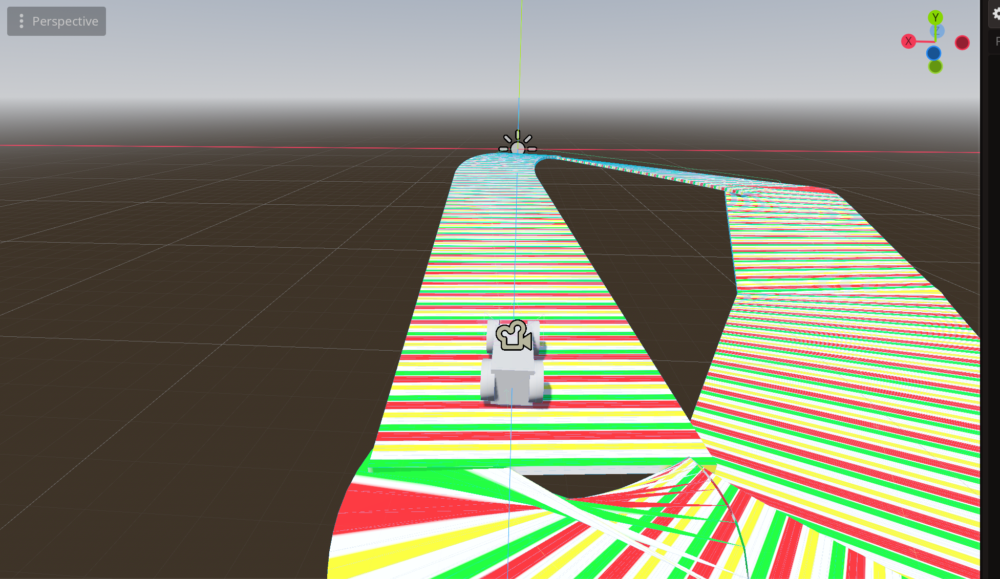

# Game Hardware Controller Mario-Kart
This is a simple hardware controller system written in GDscript for the engine side of things and in C++ for the Arduino/ESP32 code.

## Team Members
* Michael Atteh
* Jacob Janowitz
* KC Ozoemene

## Task
We were given the task of prototyping a game controller using equipment that we had, and creating a game for it to be used for, and out of the given options, we chose mario-kart, as it would translate well to what we had, an esp32, a button and an IMU.

## Design
After deciding what game to make, we then designed our controller using tinkerCAD. This is our design, made by **Jacob Janowitz**:

**Link to video below! Click the image**
[](https://youtu.be/nApS27x1zCc)

Our design features a potentiometer in place of our IMU, and uses LEDS to visualize the digital and analog information we are capturing.


## Implementation Arduino/C++

Our Implementation on the Arduino side makes use of previous code set up by **Michael Atteh** but with changes to fit the current context. It uses the IMU information over SPI protocol to send the information, specifically, due to my old code, it needs a wifi connection so it has the option to send the information over Wifi.

It isolates one rotation value specifically the Z-axis and sends it over to Godot, or in case that isn't working, over WIFI.

It also reads the value of the digital button, sending 1 when it is not pressed and 0 when it is. the resistors layed out in the wiring are not present, as the ESP32 I/O pins have built in resistors. This is used specifically for the button to allow for the information to be properly read.


```cpp
#include <WiFi.h>
#include <AsyncUDP.h>
#include <Adafruit_BNO08x.h>

// WiFi credentials
const char* ssid = "SHOOBY";
const char* password = "MichaelA";

//Digital Button
#define BUTTON_PIN 27
int buttonState = 0;

// BNO08x SPI Pins
#define BNO08X_CS    33
#define BNO08X_INT   26
#define BNO08X_RESET 32


//Bno08X Connections ##VERYYY IMPORTANT!!!
//VCC -> 3.3V
//GND -> GND
//SCL -> 18
//SDA -> 19
//AD0 - 23
//CS -> 33
//INT -> 26
//RST -> 32
//PS1 -> 3.3V
//PS0 -> 3.3V
//PUSHBUTTON-DATA -> 27
//PUSHBUTTON-GROUND -> GROUND 

// BNO08x object
Adafruit_BNO08x bno08x(BNO08X_RESET);

// UDP object
AsyncUDP udp;

// Destination IP and port
IPAddress destIP(192, 168, 137, 1);
const uint16_t destPort = 1234;

String failMessage = "Failed to find BNO08x chip";

String successMessage = "BNO08x Found!";
void setup() {
  Serial.begin(115200);

  //Set the button pin as input with internal pull-up resistor
  pinMode(BUTTON_PIN, INPUT_PULLUP);

  

  // Connect to WiFi
  ConnectWifi();

  // Initialize BNO08x
  InitializeBnO08X();
}

void loop() {
  

  // Read and send all available sensor events
  sh2_SensorValue_t sensorValue;
  while (bno08x.getSensorEvent(&sensorValue)) {
    if (sensorValue.sensorId == SH2_ROTATION_VECTOR) {
      // Format: real, i, j, k, accuracy
      String message = 
                      String(sensorValue.un.rotationVector.real, 6) + "," +
                       String(sensorValue.un.rotationVector.i, 6)    + "," +
                       String(sensorValue.un.rotationVector.j, 6)    + "," +
                       String(sensorValue.un.rotationVector.k, 6)    + "," +
                       String(sensorValue.un.rotationVector.accuracy);

      udp.print(message.c_str());
      //Serial.println("Sent: " + message);
      
      
      
      
      
      delay(100);

      // Read the state of the button as input with internal pull-up resistor
      buttonState = digitalRead(BUTTON_PIN);
  
      //Serial.print("{Buttonstate: ");
      Serial.println(String(buttonState)+String(sensorValue.un.rotationVector.k));
      //+String(sensorValue.un.rotationVector.i)+","+String(sensorValue.un.rotationVector.j)+","

      //Serial.print("X: ");
      //Serial.println();
      //Serial.print(",");

      //Serial.print("Y: ");
      //Serial.println(String(sensorValue.un.rotationVector.j));
      //Serial.print(",");

      //Serial.print("Z: ");
      //Serial.println(String(sensorValue.un.rotationVector.k));
      

    }
  }
  //delay(2); // Small delay for stability

  
  
  
  
}

void InitializeBnO08X(){
  Serial.println("Initializing BNO08x...");
  if (!bno08x.begin_SPI(BNO08X_CS, BNO08X_INT)) {
    Serial.println("Failed to find BNO08x chip");
    udp.print(failMessage.c_str());
    while (1) delay(10);
  }
  Serial.println("BNO08x Found!");
  udp.print(successMessage.c_str());

  // Enable rotation vector report (every 10ms = 100Hz)
  bno08x.enableReport(SH2_ROTATION_VECTOR, 10000); // microseconds
}

void ConnectWifi(){
  WiFi.mode(WIFI_STA);
  WiFi.begin(ssid, password);
  Serial.println("Connecting to WiFi...");
  if (WiFi.waitForConnectResult() != WL_CONNECTED) {
    Serial.println("WiFi Failed!");
    while (1) delay(1000);
  }
  Serial.print("WiFi Connected. IP: ");
  Serial.println(WiFi.localIP());

  // Connect UDP
  if (udp.connect(destIP, destPort)) {
    Serial.println("UDP connected!");
    udp.print("UDP CONNECTED!");
  } else {
    Serial.println("UDP connection failed!");
    while (1) delay(1000);
  }

}
```

## Implementation GODOT
On the godot side, we were able to find a plugin that can send the information from a microcontroller over through the port, by reading serial information, thanks to **KC Ozoemene**. This saved us alot of trouble, as we did not all have unity on our systems and did not have time to work out Ardity, but GDSerial(the plugin) was very easy to setup and use! **KC** then helped us set up the plugin and the initial code, and make sure it worked.

I then improved upon this by creating a car and a race track using Godot, then improving the script to translate the input from the controller to the car.

```gdscript
func _on_data(port: String, data: PackedByteArray) -> void:
	print("Data from", port, ":", data.get_string_from_utf8())
	data_string = data.get_string_from_utf8().strip_edges()
	if data_string.is_valid_int():
		button_state = int(data_string)
	elif data_string.is_valid_float():
		k_value = float(data_string)
	print("k_value:", k_value, " button state:", button_state)
```

```gdscript
func _physics_process(delta: float) -> void:
	steering = move_toward(steering, root.k_value * Max_Steer, delta * 10)
	engine_force = (1 - root.button_state ) * Engine_Power
```

## Video showcasing functionality

Here is a video showcasing functionality below:
[](https://youtu.be/m0kDOVS45Ns)


